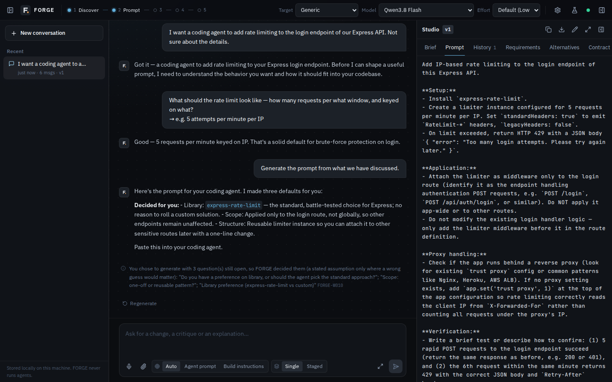
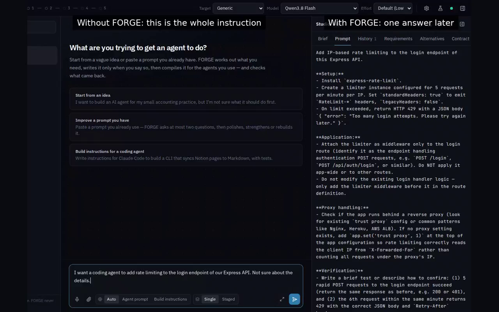
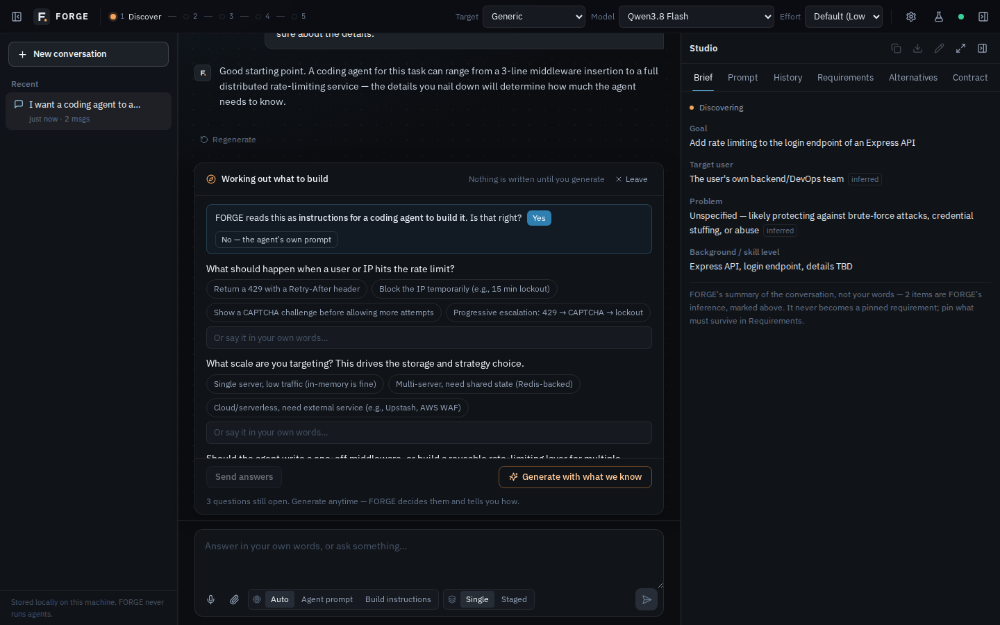
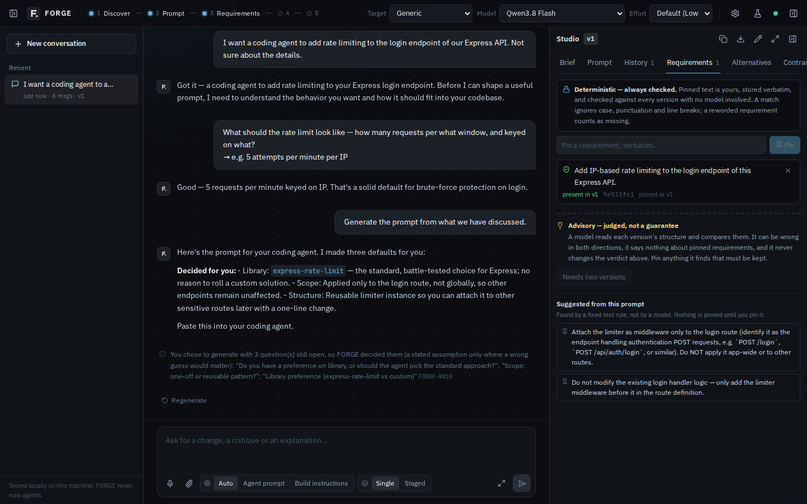
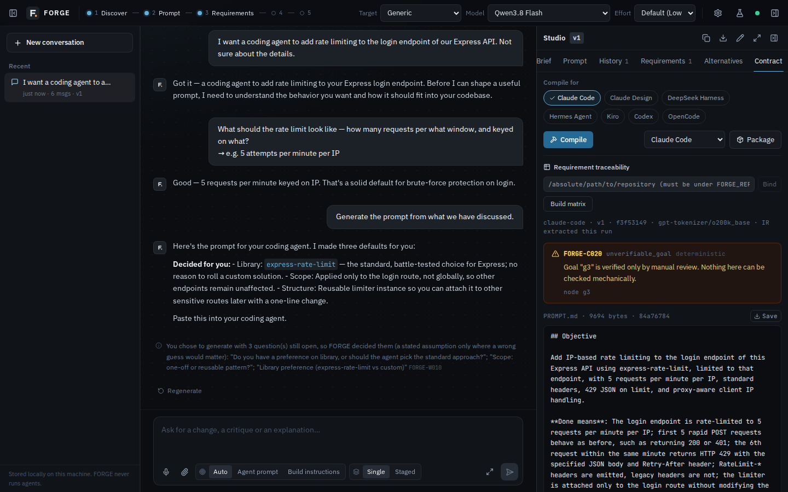
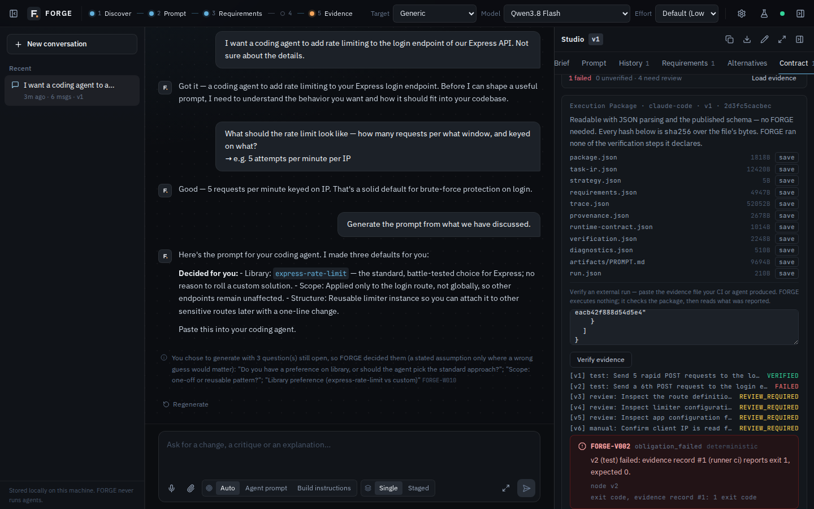
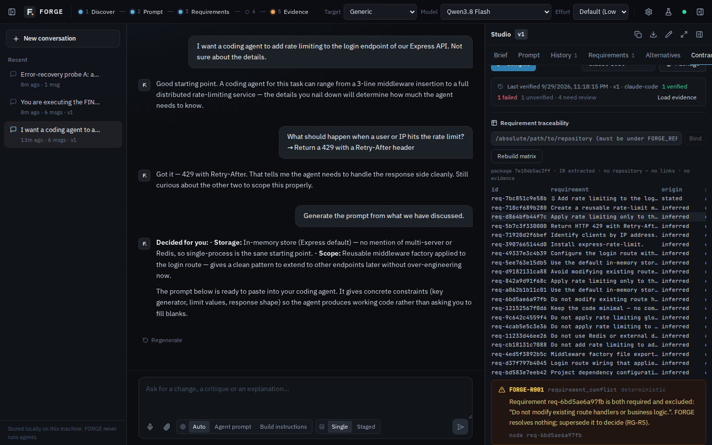

https://github.com/user-attachments/assets/e253ebbc-b33b-461b-8617-43ae8c47dec5

<h1 align="center">
  <picture>
    <source media="(prefers-color-scheme: dark)" srcset="docs/brand/wordmark-dark.svg">
    
  </picture>
</h1>

<p align="center"><strong>Turn intent into auditable instructions for AI agents.</strong></p>

**An auditable intent, requirement, compilation and verification layer between
people and AI coding agents.** You describe a task — a vague idea or a prompt you
already use. FORGE turns it into one reviewable, versioned artifact, compiles it
for a specific agent, packages it as an Execution Contract, and later checks an
external run's evidence against it — and it tells you, mechanically, when
something you asked for did not survive.

FORGE never executes anything. The agent runs elsewhere; FORGE ends at the
artifact and reads the evidence back.

```
Idea ─▶ Discovery ─▶ Requirements ─▶ Generate ─▶ Compile for a target ─▶ Execution Contract
                                                                              │
             Explain ◀── Verify ◀── Evidence ◀── (your agent / CI runs it) ◀──┘
```

<!-- demo: replace the poster link below with the GitHub user-attachment URL of
     docs/media/forge-demo.mp4 when publishing (docs/media/README.md). -->
[](docs/media/forge-demo.mp4)

*A real session against a live model (OpenCode Go, `qwen3.8-flash`). Only the model's
waiting time is shortened, and each wait is labelled with its real duration
([how](docs/media/README.md)). The whole session took 4 min 57 s, 4 min 17 s of it waiting on the model.*

**The same session at real speed** — the sentence that was typed next to the prompt
FORGE produced from it, then each later stage
([25 s](docs/media/forge-compare.mp4)):

[](docs/media/forge-compare.mp4)

This shows what FORGE adds to the artifact, not that an agent does better with it — see
[What FORGE does not claim](#what-forge-does-not-claim).

| Discovery asks before it writes | The current prompt, versioned |
|---|---|
|  |  |
| **Pinned requirements, checked without a model** | **Compiled for a target, with coded diagnostics** |
|  |  |
| **Evidence → a verdict per obligation** | **Traceability: origin, decisions, verdicts** |
|  |  |

> **Status: alpha (`0.1.0-alpha.0`).** The deterministic core is solid and well
> tested. The product around it is not finished. Read
> [What FORGE does not claim](#what-forge-does-not-claim) before adopting it — it is
> unusually specific, on purpose.

## Why it exists

A person with a real engineering task and a capable coding agent has no reviewable
artifact between them. You type a sentence and hope, or you hand-write a long prompt
that works once and is not portable, versioned, diffable, or attributable. In all
three cases **the task itself is never represented** — it lives only as prose, and
prose cannot be type-checked, diffed, ranked, attributed, or recompiled for a
different target.

FORGE represents it. The load-bearing idea is the **Task IR**: a provider-independent
structure for engineering intent that is checkable, diffable, attributable and
reusable.

## What it actually gives you

These are the properties that are mechanically verified, not aspirations:

- **A hard constraint always reaches the artifact** (`INV-003`), or compilation fails.
- **Untrusted content never becomes an authoritative instruction**, through any field
  (`INV-002`). Trust tier is a field that changes compiler behaviour, not a filter.
- **Honest capability refusal.** Compiling for a target that cannot do what the task
  requires is *refused* (`FORGE-C030`), not quietly downgraded.
- **No silent degradation.** Every drop, redaction, demotion and refusal emits a coded
  diagnostic with evidence (`INV-012`).
- **Deterministic compilation.** Same IR and profile in, byte-identical artifact out.
- **Pinned requirements are checked without a model.** If you pin a requirement and a
  later revision drops it, a deterministic check says so. A model asked "did you
  preserve this?" can be wrong; a mechanical check cannot.
- **No composite quality score.** Permanent (`INV-008`). FORGE will never tell you
  your prompt is 97/100.

## Quickstart — the workspace

**With Docker** (nothing else to install):

```bash
git clone https://github.com/ahmadelhelbawy/forge-ai.git && cd forge-ai
cp .env.example .env      # optional: provider keys, FORGE_APP_SECRET
docker compose up --build # http://localhost:3000, published on 127.0.0.1 only
```

or `docker run -p 127.0.0.1:3000:3000 -v forge-data:/data ghcr.io/ahmadelhelbawy/forge-ai:alpha`.
Volumes, secrets, repository binding and exposure: [`docs/DOCKER.md`](docs/DOCKER.md).

**From source** — requires Node ≥ 22.13 and `pnpm` (the version pinned in
`package.json`; `corepack enable` gets it).

```bash
git clone https://github.com/ahmadelhelbawy/forge-ai.git && cd forge-ai
pnpm install
pnpm --dir web dev        # builds the core, then serves http://127.0.0.1:3000
```

Open **Settings → AI Providers**, paste a key for one provider, pick a model in
the header, and start a conversation. Keys can also come from the environment —
copy `web/.env.example` to `web/.env.local`:

| Provider | Variables |
|---|---|
| Anthropic | `ANTHROPIC_API_KEY` |
| OpenAI or any OpenAI-compatible endpoint | `OPENAI_API_KEY`, `OPENAI_BASE_URL` |
| OpenCode Go (Zen gateway) | key in Settings, or `FORGE_API_KEY` + `FORGE_BASE_URL=https://opencode.ai/zen/go/v1` |
| Google, xAI, OpenRouter | `GOOGLE_API_KEY` / `XAI_API_KEY` / `OPENROUTER_API_KEY` |

Without any provider the workspace still opens and says what is missing; the CLI's
deterministic path below needs no provider at all. For a production build, repository
binding (`FORGE_REPO_ROOTS`) and every variable, see [`web/DEPLOY.md`](web/DEPLOY.md).

### A typical session

1. **Describe the idea** — "a coding agent that adds rate limiting to our login
   endpoint". FORGE asks what it needs to know and keeps a brief; nothing is written yet.
2. **Generate** when you are ready. Unanswered questions are decided and reported,
   not left in the prompt.
3. **Pin** the requirements that must never be dropped; every later version is
   checked for them without a model.
4. **Compile** for Claude Code, Codex, OpenCode, Kiro… and **Package** an Execution
   Contract (same input, same `semantic_id`).
5. Your agent or CI runs it and writes evidence; paste it into **Verify** to get
   `VERIFIED` / `FAILED` / `UNVERIFIED` / `REVIEW_REQUIRED` per obligation.
6. **Traceability** joins each requirement to its origin, decisions, files, tests
   and verdicts; `forge explain` shows where every byte came from.

Already have a prompt? Paste it and choose **Polish**, **Strengthen** or **Rebuild**.

## The CLI

```bash
pnpm install
pnpm --filter forge build
```

The deterministic path needs no API key and no network:

```bash
pnpm forge agents                                   # list target profiles
pnpm forge ir validate <ir.json>
pnpm forge compile --ir <ir.json> --target claude-code --out ./out
pnpm forge explain --ir <ir.json> --target claude-code   # where every byte came from
pnpm forge package --ir <ir.json> --target claude-code --out ./pkg
pnpm forge verify --package ./pkg --evidence evidence.json   # did an external run satisfy it?
```

### The Execution Package

`forge package` emits the object FORGE is for: a directory you hand to a coding
agent or a CI job.

```
pkg/
  package.json            # identity, versions, and the hash of every other file
  task-ir.json            # the canonical task
  requirements.json       # every requirement, with a stable id and its origin
  artifacts/…             # the rendered instructions, at the target's own paths
  trace.json              # which bytes came from which node, rule or template
  provenance.json         # what each node was derived from, and its trust
  runtime-contract.json   # what an executor would need — declared, never granted
  verification.json       # how to check the work — data FORGE does not run
  diagnostics.json        # findings, deterministic and judged kept apart
  run.json                # the one volatile file; excluded from the identity
```

Reading one needs **JSON parsing and the published schemas under `schema/`** —
no FORGE. Every `content_hash` is `sha256` over the file's bytes, so a recipient
can verify the package with `sha256sum` alone. Two packages built from the same
IR and profile are byte-identical except `run.json`, whatever the clock says.

**FORGE runs none of it.** `verification.json` lists commands as data and the
runtime contract grants nothing; a static test asserts no code path in the core
could execute either (`INV-004`).

`forge explain --package ./pkg` reads a package back — requirements, obligations,
diagnostics and per-artifact span counts — using nothing but `JSON.parse`.

### Verifying an external run

Whoever executes the package — CI, Claude Code, Codex, a human — writes an
evidence file (`schema/verify/evidence.schema.json`): per obligation, the exit
code and **hashes** of stdout/stderr, never the raw output. `forge verify` then:

1. validates the package by **rebuilding it from its own inputs** and requiring
   every semantic byte to match, so an edited obligation cannot keep the old
   `semantic_id`;
2. ignores evidence recorded for any other package;
3. gives every obligation exactly one verdict: `command`/`test` are `VERIFIED`,
   `FAILED` or `UNVERIFIED` by exit code; `manual`/`review` are always
   `REVIEW_REQUIRED`.

It executes nothing. `VERIFIED` means *the supplied evidence, taken at its word,
shows the expected exit code*; evidence is unsigned, and the report says so.
`forge explain --package ./pkg --evidence evidence.json` shows obligation →
evidence → verdict, and the Studio has the same check under the package result.
`evals/v2g/` is a real run: a passing suite → `VERIFIED`, a genuinely broken one → `FAILED`.

### Requirement traceability

FORGE can answer, per requirement: who stated it, whether a human accepted,
superseded or found it in conflict, where the compiled artifact carries it, which
repository files and tests implement it, and what verdict external evidence gave its
obligations — the **traceability matrix**. It is a join over data FORGE already
holds; no model is asked.

```bash
pnpm forge explain --package ./pkg \
  --workspace ../my-repo \            # link requirements to files/tests (read via WorkspaceGuard)
  --governance decisions.json \       # accept / supersede / conflict (schema/requirement/)
  --evidence evidence.json            # join V2-G verdicts
pnpm forge explain --package ./pkg --json   # the matrix, byte-identical per input
```

Links are authoritative only with deterministic evidence (`rg_term`, `test_naming`);
anything asserted is shown separately as **advisory**. In the workspace, set
`FORGE_REPO_ROOTS` to the directories a conversation may bind (binding is refused
when it is unset), then use the Requirement traceability panel under Compile.
`evals/v2h/` is a real run.

Turning natural language into an IR uses a model boundary, so it needs a provider:

```bash
export FORGE_PROVIDER=openai-compatible   # or: anthropic
export FORGE_API_KEY=…
export FORGE_BASE_URL=…                   # for an OpenAI-compatible gateway
export FORGE_MODEL=…
pnpm forge task "Add rate limiting to /auth/login. Do not add dependencies." \
  --target claude-code --out ./out
```

The local workspace (conversational authoring, version history, pinned requirements,
alternatives):

```bash
pnpm --dir web dev      # http://localhost:3000
```

Everything runs on your machine. There is no hosted backend, no telemetry, and no
background process. Network access to model providers is explicit and configured by
you.

## Targets

Seven agent profiles ship today: `claude-code`, `claude-design`, `deepseek-harness`,
`hermes-agent`, `kiro`, `openai-codex`, `opencode`.

Adding a target is a YAML file in `profiles/`, not a code change. A profile declares
capabilities, retrieval strength, autonomy, and an output topology — which sections go
into which files. `kiro` gets a three-file native spec layout; `claude-design` refuses
tasks that need to write files.

## Architecture in one pass


The deterministic core is the source of truth. Language models sit at four explicitly
registered, schema-constrained, replayable boundaries — they parse; they do not
architect.

| Directory | Owns |
|---|---|
| `src/ir/` | Task IR: schema, hashing, attribution, trust, diagnostics |
| `src/compile/` | Lowering, legalization, budgeting, rendering, spans |
| `src/context/` | Workspace access, retrieval, secret scanning, trust assignment |
| `src/critic/` | Deterministic ledger and judged advisory checks |
| `src/intent/`, `src/conversation/` | The model boundaries |
| `web/` | The local workspace |

Deeper: [`intent.md`](intent.md) (why, and what would falsify it),
[`spec.md`](spec.md) (the contract), [`docs/architecture.md`](docs/architecture.md)
(design and ADRs), [`plan.md`](plan.md) (phases and a deviation log that records what
went wrong).

## What FORGE does not claim

This project pre-registered a falsifiable gate for its central claim, ran it twice, and
lost. That result is recorded rather than reinterpreted, and it constrains what is
written above.

**FORGE does not claim that a structured artifact makes an agent execute better than
the raw request.** A frozen, hash-pinned benchmark (`evals/p16/`) compared *raw task*
against *FORGE artifact* across 8 tasks with planted shortcut baits and an identical
executor. Result: **0 FORGE wins, 2 losses, 6 ties — FAIL.** An earlier gate returned
RECONSIDER. The claim is retired: tested, not demonstrated.

What survived is narrower and worth stating plainly: FORGE's value is
**specification, portability, review, and attribution** — the artifact being
checkable, diffable and attributable — not prompt quality. If you want a better
prompt, a competent frontier model will write you one, and in a blind comparison it
wrote better ones than FORGE did.

## Security and trust

FORGE is a single-user tool for your own machine and **has no login**. It listens on
`127.0.0.1` by default, refuses cross-origin writes and unknown hosts, encrypts saved
keys, never returns a key, and never sends a saved key anywhere but the endpoint it
was saved with. Untrusted content (attachments, repository files, evidence) never
becomes an instruction. Do not expose it to an untrusted network without an
authenticating proxy. Details and limits: [`SECURITY.md`](SECURITY.md).

## Known limitations

Recorded in [`CLAUDE.md`](CLAUDE.md) and `plan.md`; the important ones:

- **No login, single user.** See above.
- A long `REVISE` of a large prompt takes about two minutes — it is output-bound:
  the whole prompt is written back.
- Non-code agent prompts get a blocking scope question from the IR extractor, so
  they compile with `FORGE-C080` and cannot be packaged yet.
- IR extraction on a reasoning model can take minutes.
- Voice input is verified with a scripted recognizer only; real speech depends on
  the browser (Chromium sends audio to its vendor's service).
- Artifacts are more verbose than they need to be; sections restate one another.
- Evidence is unsigned: `VERIFIED` takes the evidence at its word.

## Development

```bash
pnpm typecheck
pnpm test               # ~1380 tests — no API key, no network required
pnpm schema:check       # generated JSON Schema matches the Zod source
./web/scripts/e2e.sh    # build, HTTP product suite, browser acceptance (Chromium)
./scripts/pack-smoke.sh # the npm tarball, installed and run outside the repo
```

`schema/` is generated — never hand-edit it; run `pnpm schema:emit`.
`web/` imports the core through `forge/dist/*`, so run `pnpm --filter forge build`
before `pnpm test` after changing anything under `src/`.

A mock passing is not a feature working. See [`CONTRIBUTING.md`](CONTRIBUTING.md) for
the testing standard, which is stricter than usual and exists for a reason.

## License

Apache-2.0. See [`LICENSE`](LICENSE).
